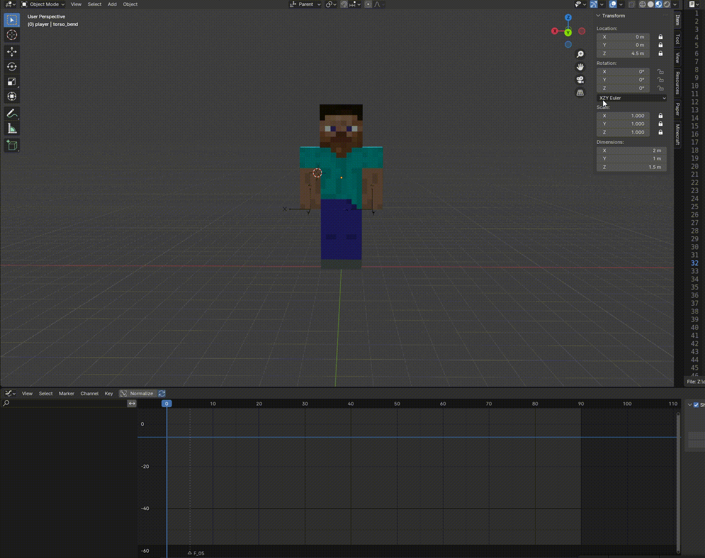

A blender addon for minecraft animations that mainly supports KosmX's minecraftPlayerAnimations and Emotecraft's animation format.

This addon is designed to work with player_model.blend

Installation: In Blender, go to **_Edit > Preferences > Add-ons > Install_** then select the minecraft_blender_addon.zip downloaded from Releases

#### Preview:



```diff
- Note: Must use have the bendy-lib mod (also by KosmX) for bending animations to work!
```

Discord: @goateeee for inquiries or feature requests
